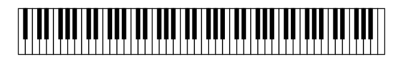
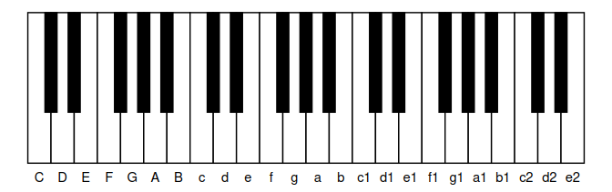
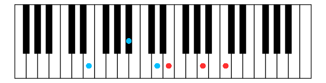

<!-- README.md is generated from README.Rmd. Please edit that file -->

# piano

<!-- badges: start -->

[](https://github.com/stibu81/piano/actions/workflows/R-CMD-check.yaml)
[](https://app.codecov.io/gh/stibu81/piano)
<!-- badges: end -->

Create visualisations of a piano keyboard with ggplot2.

## Installation

You can install the development version of piano from
[GitHub](https://github.com/) with:

``` r
# install.packages("pak")
pak::pak("stibu81/piano")
```

## Example

Use `plot_piano()` to plot a full piano keyboard with 88 keys:

``` r
library(piano)
plot_piano()
```



The range of the piano can be restricted and labels can be added:

``` r
plot_piano("C", "e2", labels = "white")
```



Chords can be marked on the keyboard using different colours for the
left and right hand:

``` r
plot_piano("F", "c3",
           mark_left = c("e", "bb", "d1"),
           mark_right = c("e1", "a1", "c2"))
```


